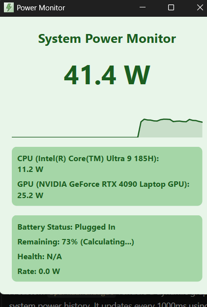
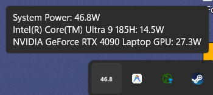

# System Power Monitor

A standalone Windows desktop application built with Python and PySide6 that monitors system power usage in real-time, displays detailed battery metrics, and runs in the system tray with a dynamic live-updating power icon.

## Features

- **Real-Time Power Metrics**: Monitors CPU and GPU power draw (NVIDIA GPUs supported via `pynvml`).
- **Battery Health**: Provides deep insights into battery charge rates, wear levels, and design capacity via WMI and Windows API.
- **Dynamic System Tray**: The application minimizes to the tray and dynamically renders the live total system power directly onto the tray icon.
- **Hardware Names**: Detects and displays your specific CPU and GPU models.
- **Sparkline Graph**: A clean, minimalistic graph visualizes power usage history.

## Screenshots

### Dashboard View


### System Tray & Hover


## Installation

1. Ensure you have Python 3.10+ installed.
2. Clone this repository.
3. Install dependencies:
   ```bash
   pip install -r requirements.txt
   ```
4. Run the application:
   ```bash
   python main.py
   ```

## Building the Executable

You can compile this application into a standalone `.exe` using PyInstaller. A build script is included:

```bash
build.bat
```

The resulting executable will be placed in the `dist` folder.
