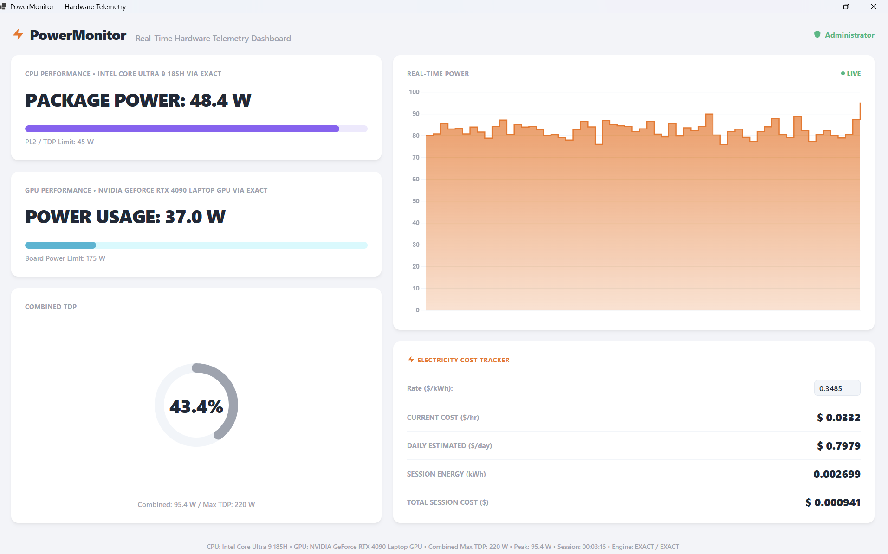

# PowerMonitor

**PowerMonitor** is a modern, standalone Windows hardware telemetry dashboard built with C# and WebView2. It provides exact, real-time tracking for CPU and GPU power usage, dynamically reads your hardware's maximum TDP limits, and includes a live electricity cost tracker.

## Features
- **Real-Time Telemetry:** Polls hardware sensors exactly matching HWiNFO64 readings every 500ms using `LibreHardwareMonitorLib`.
- **Dynamic TDP Detection:** Actively queries CPU PL1/PL2 limits and uses `nvidia-smi` to fetch the true maximum GPU board power limit (including Dynamic Boost).
- **Modern UI:** A pixel-perfect, responsive frontend dashboard built with HTML, CSS Flexbox, and Chart.js, running smoothly inside a native Windows Edge Chromium WebView2 container.
- **Cost Tracker:** Calculates your exact electricity cost per hour, per day, and per session based on your real-time cumulative wattage.

## How it Works
The application uses a hybrid architecture:
1. **Backend (C#):** A lightweight C# service runs with Administrator privileges to safely load Ring-0 kernel drivers (WinRing0) and interact with Intel/AMD MSRs and NVML.
2. **Frontend (WebView2):** The UI is rendered using standard web technologies injected directly into the Windows Form. Telemetry JSON payloads are pushed from C# to JavaScript twice a second.

## Requirements
- Windows 10/11
- Administrator Privileges (required for reading low-level kernel telemetry)
- .NET 7.0 Runtime (or download the Self-Contained Release)
